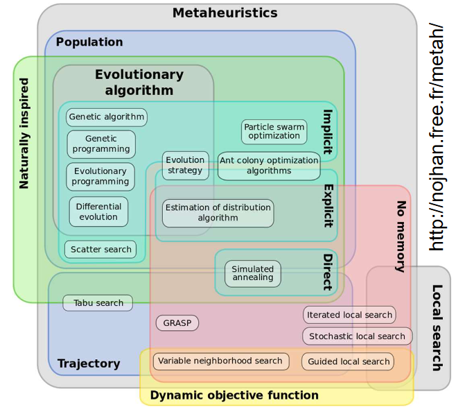

# Introduction to Genetic Algorithms
**Bioinspired Algorithms:**

- Swarm intelligence

- Evolutionary computing

- Neural Networks

- Ant colony optimization 

Evolutionary computing is a form of stochastic search, randomly searching until we find a solution. However, searching an entire solution space is intractable. ECs generally involve populations of solutions over a space of solutions.

**Requirements:**

- A population of individuals defined by some properties (Genes)

- A way to evaluate an organism's fitness (Fitness Function)

- A method for selecting fitter individuals as parents.

- A way to introduce variety into offspring

	- Copying errors (mutation)

	- Mixing genes from two parents

We must specify what we want evolution to find by defining our fitness function. This function assigns a fitness score to one individual based on its overall performance.

In order for evolutionary computation to be worthwhile it must be easier to define the fitness function than to compute the solution directly.

**Evolutionary Computing Techniques:**

- heuristic - Not guaranteed to find the best solution

- stochastic - Random

- Intended for hard optimization problems

EC techniques are examples of metaheuristic approaches. 

In contrast to EC approaches, some metaheuristic approaches do not use a population of solutions. for example Hill Climbers:

- Population - Set of individuals that the GA is acting on

- Individual - A member of the population

- Genotype - A string of symbols from some alphabet that encodes a particular solution (Sometimes called genomes or chromosomes)

- Phenotype - The actual solution encoded by a genotype

- Genotype-phenotype mapping - Analogous to development

- Genes (Loci) - Chunks of genotype each taking a value - the value is called the ‘Allele’

- Fitness - The value or quality of an individual solution phenotype

- Selection - Choosing which current individuals get to reproduce

- Parents - Individuals selected to reproduce

- Offspring - Individuals that result from reproduction

- Crossover - The recombination of the alleles from multiple parents

- Mutation - Replacing offspring alleles with random alternatives

- Fitness Landscape - An ‘evolutionary search space’ organising all possible solutions according to the neighbourhood relationships that result from the GA’s Genotype structure and Genetic operators with landscape altitude set by the fitness of each solution.

**Generating Initial Populations:**

We start with a population of individuals with random genotypes. We can then apply a fitness score to each member of the population.

We can pick the next parents proportional to their fitness. We can use roulette base selection to compute the probability that they will be selected based on their fitness.

Alternatively, we can use rank-proportionate selection to choose parents based on how they rank in fitness. 

- Sample k unique individuals at random from the population

- Pick a winner to be the parent

- To find N parents run N tournaments

**Reproduction:**

Once we have selected parents we can make a copy of their genes and put them into the next generation.

- Mutation - Each offspring gene is replaced by a random allele with probability m

- Crossover - the offspring genotype inherits genes from multiple parents

- Elitism - The fittest current individual is copied into the next generation perfectly

**Crossover:**

- One-Point - Pick a point along the genotype, the offspring inherits the first k genes from parent A and the last genes from parent B

- Two-Point - Pick a range to get from one parent and outside the range genes are taken from the other parent

- Uniform - Randomly make a decision for each gene to inherit from each parent.

The population size is generally kept constant:

- Generational Reproduction - Continue selecting and reproducing parents until we have N new  offspring

- Steady-State Reproduction - As soon as we have generated a new offspring we pick a member of the current population and kill it replacing it with the new offspring.

**Stopping Conditions:**

1. The perfect solution is found - Maximum fitness

2. We have run out of time

3. We think the GA has finished and things are as good as they are going to get.

 

 

