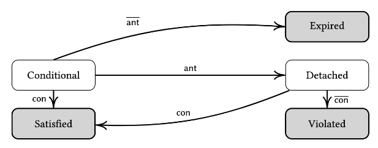
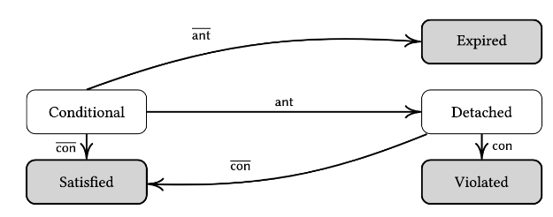
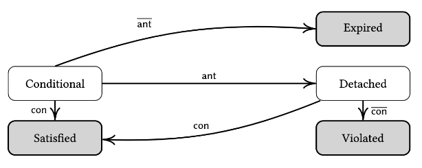

# Multiagent Systems
## Agents:

An agent is a computer system that is capable of performing independent actions on behalf of its users or owners.

An agent figures out what needs to be done to satisfy its users’ goals, rather than being told what to do.

 

For successful interaction agents must:

- Coordinate

- Negotiate

- Cooperate

 

An agent is autonomous capable of deciding for itself and performing different actions.

 

**Sense-Decide-Act Loop:**

- Engage in a close-coupled loop

- Continually interact with the environment

Agents sense the environment they perceive the result from their sensors then they execute some action with effectors.

---

**Properties of intelligent agents:**

- Reactivity

- Proactivity

- Social ability

 

**Reactivity:**

A reactive system is one that maintains an ongoing interaction with its environment and responds to changes that occur in the environment

A response needs to be in-time for it to be useful

 

**Proactivity:**

- Systematically working to achieve a goal

- Anticipate and take initiative

 

**Social Ability:**

Social ability in agents is the ability to interact with other agents via a communication language

- Coordinate

- Negotiate

- Cooperate

---

## Environment:

Properties:

- Accessibility

- Determinism

- Episodic/Non-episodic

- Static/Dynamic

 

Accessibility:

Agents have or can obtain complete, accurate and up-to-date information about the state of the environment.

 

Determinism:

A deterministic environment is one in which each action has a single guaranteed effect, there is no uncertainty about the resulting state.

 

Episodic/Non-episodic:

In an episodic environment performance of an agent is dependent on a number of discrete episodes, there is no link between the performance of an agent in different scenarios.

 

Static/Dynamic:

Static environments remain unchanged except by the performance of actions by the agent, they are entirely predictable.

Dynamic environments can be changed by other agents or processes.

---

**Sociotechnical System:**

An STS includes social entities - principals (Humans/Organisations) and other stakeholders as well as technical entities such as agents and resources

An STS is not a separate running entity but it is realised through the interactions of principals, agents and resources.

 

Norm - A directed social expectation between principals, defines a standard of correctness, types include commitment, prohibition, authorization and power.

Accountability - A principal can call another to account for its actions, derives from norms and provides opportunity for principals to explain their actions

More formally a norm is a tuple $ \left < \text{n}, \text{SBJ}, \text{ant},\text{con} \right > $

$$ n:\text{its type - commitment, prohibition, authorization, power} \\ \text{SBJ} \in \R: \text{Subject} \\ \text{OBJ} \in \R : \text{Object} \\ \text{ant} \in \text{Expr} : \text{Antecedent} \\ \text{con} \in \text{Expr} : \text{consequent} $$

**Commitment:**

The subject is committed to the object that when the antecedent holds, the subject will bring about the consequent. The accountable party is the subject of the norm.

**Prohibition:**

The subject is prohibited by the object that when the antecedent holds, the subject will not bring about the consequent. The accountable party is the subject.

**Authorization:**

The subject is authorized by the object that when the antecedent holds, the subject can bring about the consequent. The accountable party is the object, they are responsible for the state of the antecedent.

**Power:**

The object empowers the subject to bring about the consequent by bringing about the antecedent. A power is the ability to alter the norms between two or more principals.

 

