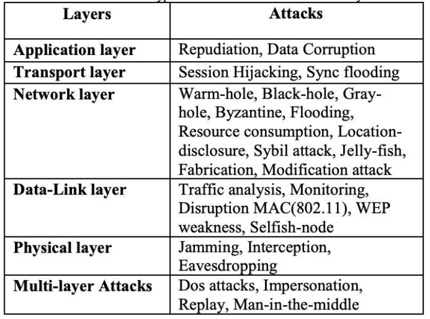

Nonrepudiation - Proving message delivery and the sender’s identity.

**Classical Encryption Techniques:**

Operations - Substitution/Transposition

Number of keys used - Symmetric (single secret key), Asymmetric (public + private keys)

Plaintext processing - Block cypher (Encrypting in chunks), Stream cypher (Encrypting characters.

For asymmetric encryption secret keys must be exchanged via a secret channel.

Unconditionally Secure - No matter how much time the opponent has, it's impossible to decrypt the cypher text.

Computationally Secure - The cost of breaking the cypher exceeds the value of the information.

Asymmetric Encryption uses the private key to verify the author by encrypting with the private key, the recipient then decrypts with the public key. This means it provides integrity of the author but not confidentiality

**Network Security:**

Circuit Switching - Resources reserved for end-to-end communication. Call setup is required, and call rejection is possible (’busy signal’)

Multiplexing:

- FDM (Frequency Division Multiplexing) - Divide up bandwidth into different frequencies for different communications

- TDM (Time Division Multiplexing) - Divide up bandwidth into different time slots

Packet Switching - Packets compete for network resources, each packet uses full link capacity until the transmission is completed.

When a packet is received by a router it is extracted from its frame and put into a new frame.

A frame is a chunk of data created by a NIC card and router interfaces, frames contain hardware addresses such as MAC addresses of the source and destination.

**TCP/IP Model:**

Physical Layer:

The physical connection between the sender and the receiver. Including all hardware devices such as routers and modems. This layer specifies the type of connection.

Data Link Layer:

Controls the physical layer by deciding when to transmit messages over the media. It will also detect and recover errors during transmission. It will format messages by creating frames to encapsulate messages and add a header to them.

Network Layer:

Routing, selecting the next computer to which the message should be sent, find the address of that computer if it doesn’t already know it. Attaches source and destination IP addresses to a packet.

Transport Layer:

Links application layer software to the network and establishes an end-to-end connection between the sender and receiver. It will break messages into packets for transmissions. It will also detect lost messages and request the resending of messages.

Application Layer:

Application software that is used by the user. The user defines what messages are to be sent over the network.

 

