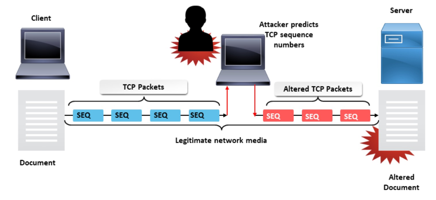

# Network Security
**Network Security Threats:**

- Intrusions - Unwanted access to a system

- Blocking - DoS

- Malware

**Domain Name System:**

DNS will resolve an IP address from a given URL by parsing the nameserver tree until it finds the given domain name. The nameserver then transmits the IP address back to the client. It is unencrypted and easily monitored.

**Threats to DNS:**

- Corrupted host platforms

- Resolvers that leak querires

- Nameservers that leak queries

- DNS Hijacking

- DNS Cache poisoning - Changing entries in a DNS table in order to redirect queries to fake websites (It can be used for censorship)

- DNS Amplification Attack (Smurf) - A single node sends a request to a router, the router forwards this request to all its connected devices, and the devices then all send their responses to a single node which will cause DoS.

**DNS Protection:**

- DoT (DNS over TLS) - The first DNS encryption solution, DNS channels the original clients request through TLS on port 853. A secure channel is established with the DNS resolver.

- DoH - Sends DNS requests over HTTPS

**HTTP:**

HTTP is a symmetric request-response client-server protocol. It uses TCP.

**HTTP Session Hijacking:**

1. Hijacker injects malicious script into the web server

2. The victim authenticates on the server

3. The server returns the page with injected script

4. The victim's browser executes the script and sends session cookies to the attacker

5. The attacker hijacks the user session

**Session Side-Jacking:**

Using packet sniffing, attackers monitor session traffic and intercept cookies after the user has authenticated with the server. If the website only uses SSL/TLS encryption for login pages and not for the entire session the hijacker can use the sniffed session ID to hijack the session. The hijacker needs access to the victim's network. Using HTTPS can prevent this as it will encrypt all traffic over HTTP.

**TCP Session Hijacking:**

When the attacker is on the same network as the client, the attacker can sniff TCP packets and know the ACK/SEQ numbers. Attackers can then inject a packet with the correct ACK/SEQ numbers with a spoofed IP address. 

**SYN Flooding Attack:**

An attacker sends a large number of SYN requests to a target's system. The target then uses a lot of resources to attempt to process these requests. Usually, SYN flood packets use spoofed source IP addresses, and no TCP connection is ever established. It makes it very hard for the target to work out which TCP SYN is a legitimate connection attempt.

**SYN Flooding Solutions:**

- Ingress Filtering - Routers install filters to drop packets from networks that are not downstream.

- uRPF Checks - Accept packet from interface only if forwarding table entry for source IP matches ingress interface. If there are multiple routes between the client and server this check can no longer work as it may only show up in a few forwarding tables. 

- TCP SYN cookies - The client and server require SYN/ACK numbers to be as expected.

**IP Spoofing:**

The creation of fake packets with fake source IP addresses to impersonate another computer. The hacker intercepts a TCP handshake before the source manages to send its SYN-ACK message. Instead, the hacker sends a fake confirmation including their device address (MAC) and a spoofed IP address. It used generally used to bypass firewalls that rely on blacklisting. It can also be used for DoS attacks using SYN flooding attacks. IP spoofing is used in man-in-the-middle attacks to pretend they are both the client and server.

**ARP: Address Resolution Protocol**

ARP Resolves IP addresses to MAC addresses. Each IP node on a LAN has an ARP table (Host, Router). The ARP table is a mapping from IP addresses to MAC addresses. It works by broadcasting and caching responses. The protocol begins with a computer broadcasting a message of the form “who has <IP address 1> tell <IP address 2>” when the machine with “address 1” receives the message it broadcasts its MAC address back to “address 2”.

**ARP Spoofing:**

- The ARP table is updated whenever an ARP response is received

- Requests are not tracked, ARP announcements are not authenticated and machines trust each other.

- ARP caches can be poisoned by sending fake ARP replies, ARP tables will update themselves even if they didn't send a request. 

**Common types of DDoS attacks:**

- Application layer attacks - HTTP

- Protocol Attacks - TCP (SYN Flooding)

- Volumetric Attacks - DNS Amplification.

 

