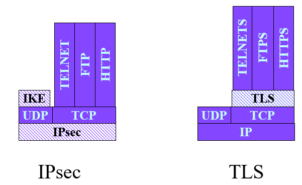

# Security Protocols
**SSL (Secure Socket Layer):**

- Introduces a security layer between the transport and application layers to protect data layers.

- Ensures protection of TCP-based applications (HTTP, telnet, FTP…)

- Secure application protocols become HTTP, telnets and FTPS. 

 

**TLS (Transport Layer Security):**

- TLS uses symmetric cryptography for verifying data integrity.

- TLS Sub protocols are similar to SSL ones: TLS handshake, TLS cypher spec protocol, and TLS alert protocol.

**Initialisation Phase:**

- The server must authenticate to the client via its public key certificate. 

- The client can optionally authenticate to the server via its public key certificate.

- They then negotiate security services and mechanisms. They agree on security parameters (compression method, encryption algorithms) for the confidentiality, authentication, and integrity services.

- Establishes a master key (secret key)

- Messages of the initialization phase are protected in integrity and authenticity.

- This phase is implemented by a software sub-module of TLS (TLS handshake protocol).

**Data Protection Phase:**

- Data Confidentiality

- Data integrity/authentication

- Usage of symmetric cryptography to protect this phase.

- Phase implemented by a sub-module (TLS Record protocol)

**TLS Record Protocol**

Fragmentation → Compression → Encryption → MAC Introduction (Message Authentication Cypher (Hash function))

Data Block → Data Fragment → Ciphered Fragment → Ciphered Fragment with MAC.

**TLS Sub-Protocols:**

- TLS Alert Protocol - Alarms transmission through the TLS record protocol.

- TLS Change Cypher Protocol - Move to a new security context by the sender.

- TLS Application Layer Protocol - Direct data communication to the TLS record protocol layer

- TLS Handshake Protocol - Authentication and Security parameter establishment.

**IPSec (IP security)**

Used to protect IP traffic between two remote networks.

**Initialization Phase:**

- A public key certificate is used both ways for authentication.

- Negotiation of security services.

- Establishment of a secret key.

- This phase is implemented at the application level module.

**Data Protection Phase:**

- Data Confidentiality/Authenticity/Integrity

- Create a secure tunnel to protect an IP packet flows

It can be used in tunnel mode, which nests packets inside each other for extra protection.  It can be used to provide access to organisations’ intranet remotely.

**Security Associations (SA):**

A contract between two entities detailing security parameters used for communication. 

- Security protocol to be established Authentication Header or ESP. Hash functions, encryption keys

- IPsec Protocol Mode - Tunnel/Transport

- Internet Key Exchange protocol (IKE)

**Virtual Private Network:**

VPNs are used for facilitating communications between companies and their partners. They establish an IP tunnel to exchange data through the tunnel, security is optional to protect the tunnel.

An IP tunnel encapsulates a packet inside another IP packet. 

Two remove local networks are virtually forming the same network via the tunnel. This allows the lighter filters to be done by the private network and internal private IP addresses can be used.

**Securing the Tunnel:**

- IPsec

- TLS

- Uses two successive phases, initialization (Authentication - Certificates, Key Agreement, Negotiation of security associations) and data exchange ensuring data integrity, confidentiality and authentication of data origin.

**Interconnecting two LANS:**

- VPN supported by gateways

- Protocol - IPsec

**Remote Access to a network from a nomad:**

- IPsec or TLS.

**Layer Two Tunneling Protocol (L2TP)**

Connecting a nomad to a remote network.

It creates a tunnel between the network and the individual, it doesn’t have services to ensure data protection and therefore it's usually used with IPsec. It requires an L2TP client on the nomad’s device and an L2TP server to manage the tunnels.

**TLS VPN:**

- Clientless solution - Webised applications - the gateway translates data returned by the applications into web data. It can only access website data. No need to install clients, and lower costs.

- Non-clientless - Heavy TLS clients however can access any data. Access to a private network similar to a local connection, A IPsec/VPN client is required by the nomad.

**IPSEC:**

- A common

-  solution for all applications

- Adapted to VPN (site to site and nomads)

- Heavy to manage, requires application layer IKE module.

**TLS:**

- The most common solution

- Largely used for nomads’ remote access protection (VPN)

- According to TLS VPN, solutions provides limited access to certain applications.

 

 

