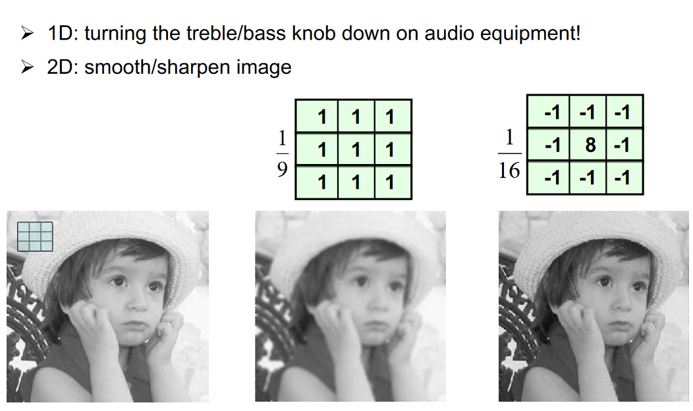
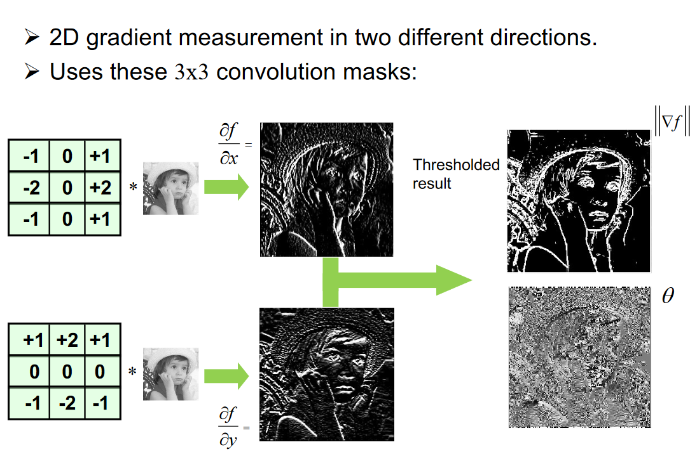
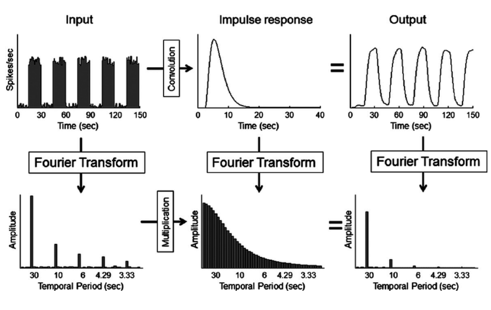

# Convolutions
Convolutions use filters/masks/kernels to filter a signal and symbols in the spatial/time dimensions

- Remove noise/outliers

- Smoothing/averaging detail

- Sharpening/Highlighting detail 

The neighbourhood of an element in a signal determines how the convolution transforms it. The convolution mask is applied to all elements in a signal.

**Discrete 1D convolution:**

$$ g(x)=\sum_{m=-s}^sf(x-m)h(m) \qquad \forall s\ge1 $$

$$ f \text{ is the signal, } h \text{ is the convolution filter} $$

Example convolution filter:

$$ \frac{1}{5}[-1, 3,-1] $$

Where 1/5 is the **normalization factor**, this is the sum of the absolute values of the filter. In this case, 3 is the **origin **of the filter. The values at the edge of the signal are lost or set to zero as the convolution filter must be fully contained inside the signal.

$$ g=f*h\qquad *=\text{Convolution Symbol} $$

Correlation = Convolution when the kernel is symmetric under 180-degree rotations.

**2D Convolution:**

$$ g(x,y)=\sum_{m=-1}^1\sum_{n=-1}^1f(x-m, y-n)h(m,n) $$

**2D Correlation**

.

$$ g(x,y)=\sum_{m=-1}^1\sum_{n=-1}^1f(x+m, y+n)h(m,n) $$

Edges occur in images when there is a change in the intensity function. The gradient points in the direction of the most rapid change in intensity.

 

Convultion in the spatial domain is equivalent to multiplication in the frequency domain and vice versa.

