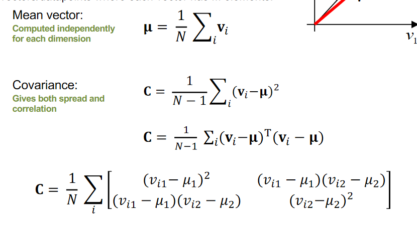
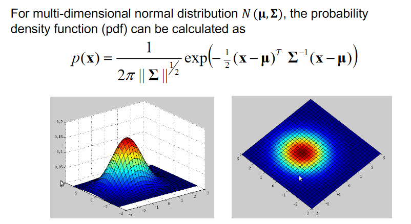

# Distance Measures
**P-Norm Distances:**

$$ D(x,y) = (\sum_{i=1}^{n} |x_i-y_i|^p)^{\frac{1}{p}} $$

n = dimensions

**Chebyshev Distance:**

$$ D_{chebyshev}(x,y) = max_{i}^{n}(x_i, y_i) $$

**Hamming Distance:**

For equal-length strings, the hamming distance is the number of pairs of characters (a, b) where a != b and a and b have the same index in their respective strings

**Edit Distance:**

The number of substitutions, deletions or additions required to make two strings match.

**Nyquist Sampling Rate Theorem:**

The sampling rate must be at least twice the analogue wave frequency. A naive method is to find the wave’s highest frequency (shortest period) and double it for the sampling rate.

**Mean and Variance:**

u = mean

o = standard deviation

$$ o^2=\frac{1}{N-1}\sum_{i=1}(v_i-\mu)^2 $$

For multidimensional data:

A covariance matrix is always square and symmetric, with variance on the diagonal, covariance between each pair of dimensions is stored on the non-diagonal elements.

The eigenvectors of a covariance matrix define the principal axis of the spread, a larger eigenvalue indicates a larger variance. The major axis corresponds to the larger eigenvalue.

Definition:

for a square matrix C, if there exists a non-zero column vector v where

$$ Cv=\lambda v $$

then v = eigenvector and lambda = eigenvalue

$$ det(A-\lambda I)=0 $$

**Gaussian Distribution:**

$$ p(x)=\frac{1}{\sqrt{2\pi}\sigma}e^{-\frac{(x-\mu)^2}{2\sigma ^2}} $$

**Data Normalisation:**

- Rescaling 

$$ x'=\frac{x-min(x)}{max(x) - min(x)} $$

- Standardisation (z-score) 

$$ x'=\frac{x-\mu}{\sigma} $$

- Scale to unit length 

$$ x'=\frac{x}{||x||} $$

**Outliers:**

A small number of points with values significantly different from that of the other points, usually due to a fault in measurement.

 

