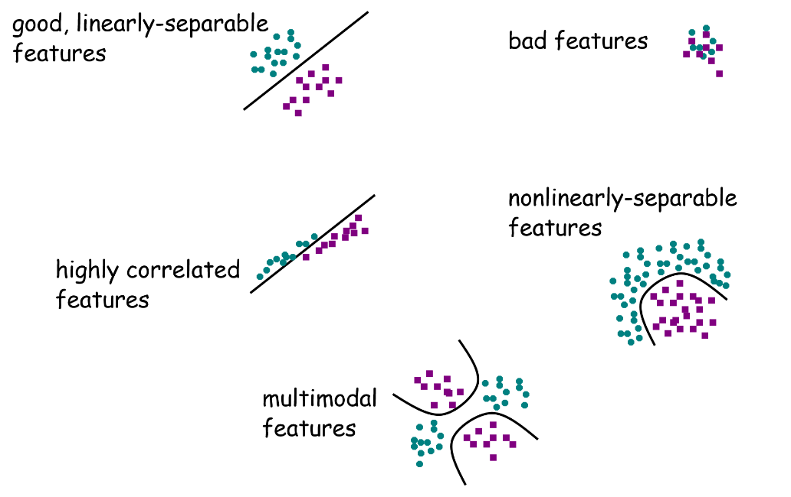
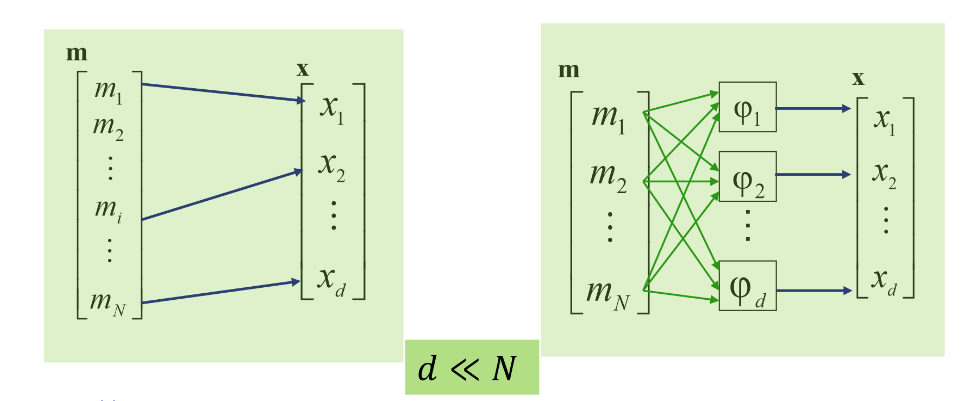

# Feature Classification
The combination of d features is represented as a d-dimensions feature vector. This vector defines a point in the feature space. Good classifying features are ones that are linearly separable.

**Dimensionally Reduction:**

- Strive for a compact representation of the properties of the data

- This compact representation removes redundancy/irrelevancy

- This can influence the accuracy of classification, the number of learning examples, the time needed for classification and the difficulty in performing classification.

This is performed either by feature selection or feature extraction.

**Feature Selection:**

Selecting a subset of the existing features without a transformation. Given a feature set {x_i} of size N  find a subset of X of size d that optimises an objective function J(x). That function would be evaluated N choose d number of times. 

$$ \frac{N!}{(N-d)!d!} = n \text{ choose }d $$

However this can be performed heuristically by assuming all features are independent, the best single features can be chosen by significance tests.  

**Step-Wise:**

- Bottom-up: The best single feature is picked first, and the next best feature is then conditioned to the first.

- Top-down: Start with a full set of features and remove the redundant ones.  

**Feature Extraction:**

Transform existing features into a lower dimensional space. Linear or non-linear transformation of the original variables to a lower dimensional feature space also known as feature selection in the transformed space.

Given a feature space R^N with feature vectors m, find a mapping:

$$ x=\varphi(m):R^N\implies R^d, d<N $$

such that the transformed feature vector:

$$ x=\{x_i\}\in R^d $$

preserves most of the information or structure in R^N.

The Eigenvectors and Eigenvalues define the principal axes and spread of points along directions

- Major axis - Eigenvector corresponding to the larger Eigenvalue

- Minor axis - Eigenvector corresponding to the smaller Eigenvalue

Feature selection can be performed by removing any dimensions that don’t contribute to large Eigenvalues. Thereby removing the dimensions with low variance in the data.

A key factor in good dimensionality reduction is to maintain as much of the variance as possible.

The sum of the variances = the sum of Eigenvalues = 100% of the variance in the original data. The proportion of variance that each  Eigenvector contributes can be determined by dividing its Eigenvalue by the sum of all the Eigenvalues

$$ \frac{\sum_{i=1}^d\lambda_i}{\sum_{i=1}^N\lambda_i}=\% \text{ of variance retained after dimensional reduction} $$

 

