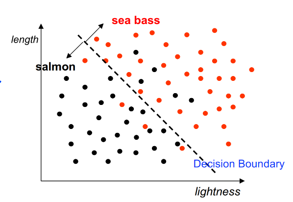

# Introduction
Image Classification:

Steps:

1. Pre-processing - Rotate and align images

2. Feature Selection - Measure properties in the image

3. Classification - Find a threshold that classifies different images

Using multiple features for classification results in a multi-dimensional feature vector. This idea can be extended to higher dimensions. However, a complex model can lead to overfitting the specific dataset.

 

[//]: # (column_list is not supported)

	[//]: # (column is not supported)

		

	[//]: # (column is not supported)

		

Speech Recognition:

1. Pre-processing - Digitisation

2. Feature Selection - Wave amplitude, frequencies

3. Inference - Deep learning, etc…

 

