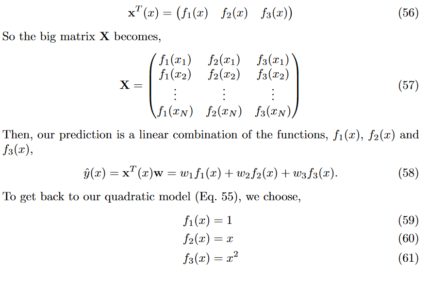

# Regression
The sum of the vertical distances between data points and a prediction line can act as a quantifier of how good this prediction is.

**Loss Function (Naive):**

$$ L=\sum_{i=1}^N|\hat{y}(x_i)-y_i| $$

**Squared Difference loss function:**

$$ L=\sum_{i=1}^N(\hat{y}(x_i)-y_i)^2 $$

Each family of predictions can be written as functions with parameters that can be optimised. 

$$ \hat{y}const=w_1 \qquad\hat{y}slope=w_2x \qquad \hat{y}straight=w_1+w_2x $$

**In the case of const, this will expand to a quadratic with a minimum point:**

$$ L(w_1)=\sum_{i=1}^N(y_i-w_1)^2 \qquad \frac{\delta L(w_1)}{\delta w_1}= \frac{\delta}{\delta w_1}\sum_{i=1}^N(y_i - w_1)^2=0 $$

$$ 0=Nw_1-\sum_{i=1}^Ny_i \qquad w_1=\frac{1}{N}\sum_{i=1}^{n}y_i=mean(y_i) $$

**slope:**

$$ L(w_2)=\sum_{i=1}^N(y_i-w_2x)^2 \qquad \frac{\delta L(w_2)}{\delta w_2}=\frac{\delta}{\delta w_2}\sum(y_i-w_2x)^2=0 $$

$$ 0=\sum_{i=1}^N(-2y_ix_i+2x_i^2w_2) \qquad 0=w_2\sum_{i=1}^Nx_i^2-\sum_{i=1}^Ny_ix_i $$

$$ w_2=\frac{\sum_{i=1}^Ny_ix_i}{\sum_{i=1}^Nx_i^2} $$

**Straight:**

$$ L(w_1,w_2)=\sum_{i=1}^N(y_i-(w_1+w_2x))^2 $$

$$ 0=\frac{\delta L(w_1, w_2)}{\delta w_1} \qquad and \qquad 0=\frac{\delta L(w_1, w_2)}{\delta w_2} $$

$$ w_2=\frac{\overline{xy}-\bar{x}\bar{y}}{\overline{x^2}-(\overline{x})^2} \qquad \overline{x}=mean(x) \qquad w_1=\frac{1}{N}\sum_{i=1}^N(y_i-w_2x_i)=\bar{y}-w_2\bar{x} $$

**Multivariable Regression:**

The inputs are defined as an NxM matrix where each data point is a row in the matrix and the columns are the different coordinates in each axis of each data point. N data points with M dimensions. The output will be a vector.

$$ x_i=(x_{i1},x_{i2},x_{i3}) = \text{data point} $$

$$ \hat{y}(x_i)=x_i^Tw=\sum_{j=1}^Nx_{ij}w_j \qquad i=\text{data point} \qquad j=\text{feature}  $$

$$ w=\text{weight vector to minimise loss} $$

$$ L(w)=\sum_{i=1}^N(x_i^Tw-y_i)^2 $$

$$ \hat{y}(x)=w^{*T}x \qquad w^*=(X^TX)^{-1}X^T=\text{optimal weight} $$

N = number of data points

D = number of features

X = NxD

y = Nx1

**Non-Linearity:**

$$ \hat{y}quad(x)=w_1+w_2x+w_3x^2 $$

$$ \underline{x}(x)= \begin{bmatrix} \delta_1{(x)} \\ \delta_2{(x)} \\ \delta_3{(x)} \end{bmatrix} \qquad \delta_1(x)=1\space \space \delta_2(x)=x\space \space \delta_3(x)=x^2  $$

$$ \hat{y}(x)=w^T\underline{x}(x) $$

**Over fitting, Regularisation and Cross-Validation:**

Having too little data can lead to a model fitting the data accurately but not fitting the original function they were sampled from. If all the data happens to be in a single plane or fewer dimensions than the space the same thing can happen as there isn’t enough data in a particular dimension.

Having too high of an order of a function for the model will lead to over fitting as the model will try to pass through all the data points including the ones with high noise. This can lead to an inaccurate model at the edges.

Cross-validation is where extra data, not used to train the model, is used to calculate the squared error between this data and the model. This will provide a validation error which can be minimised by picking a particular function.

Regularisation is to add some penalty to large weights artificially. As the model moves towards higher orders the weights tend to get very large as it attempts to fit every point. Regularisation can limit these weight values. Cross-validation is then used to validate the error caused by a combination of function order and regularisation.

 

$$ L(\underline{w})=\sum_{i=1}^N(\hat{y}(\underline{x_i})-y_i)^2+\lambda\sum_{j=1}^Dw_j^2 $$

$$ w^*=(X^TX+\lambda I)^{-1}X^Ty $$

 

