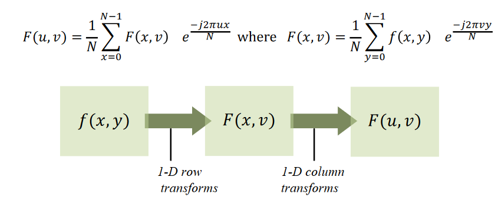
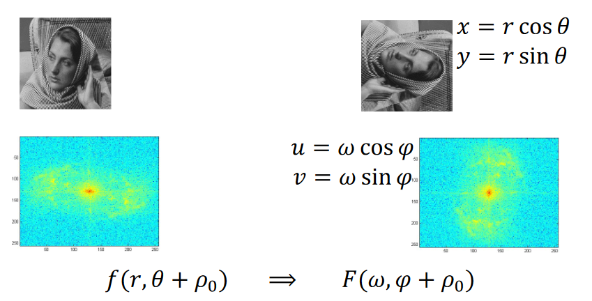
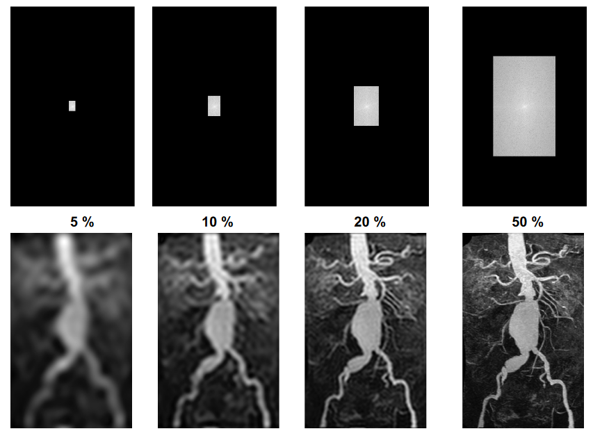
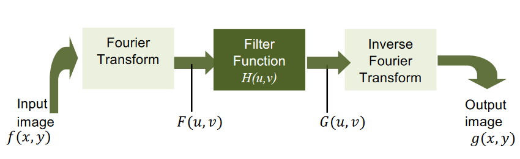
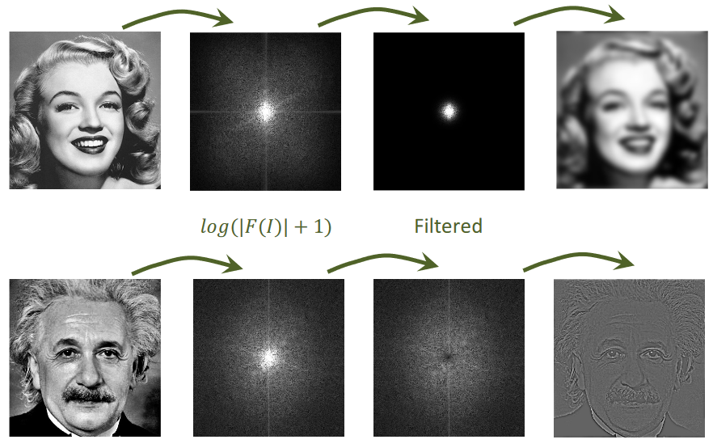

# Signals And Frequencies
The following basic signals can represent all signals

- Unit Impulse Signal - At f(n=0) = 1 f(n != 0) = 0

- Unit Step Signal - f(n < 0) = 0 and f(n >= 0) = 1

- Exponential Signal

- Periodic Signal

A signal is a physical quantity that is a function of one or more independent variables. An image is an example of a signal in space, a video is a signal in space and time.

 

**Superposition:**

For a linear system, the output of the linear combinations of many input signals is the same as the linear combination of the outputs. A complex signal can be broken down into a sum of different sinusoids at different frequencies. The combined frequency will be the highest common factor of the frequencies of all the frequencies that make it up.

**Trigonometric Fourier Series:**

$$ f(x)=a_0+\sum_{n=1}^{\infty}a_n\cos \left(\frac{2\pi nx}{T}\right)+b_n\sin \left(\frac{2\pi nx}{T}\right)\qquad T=\text{period} \qquad n=\text{cycles} $$

$$ a_n,b_n \text{ are the fourier coefficients} $$

$$ a_n=\frac{2}{T}\int_{-T/2}^{T/2}f(x)\cos\left(\frac{2\pi nx}{T}\right)dx $$

$$ b_n=\frac{2}{T}\int_{-T/2}^{T/2}f(x)\sin\left(\frac{2\pi nx}{T}\right)dx $$

A Fourier space represents the a_n and b_n values for a given value of n representing the number of terms in the sequence.

**Fourier Transform:**

Continuous Form:

$$ \text{FT: }F(u)=\int_{-\infty}^{\infty}f(x)e^{-j2\pi ux}dx $$

$$ \text{Inverse FT: }f(x)=\int_{-\infty}^{\infty}F(u)e^{j2\pi ux}du $$

Discrete Form:

$$ F(u)=\frac{1}{N}\sum_{i=1}^Nf(x)e^{\frac{-j2\pi ux}{N}}
\qquad\forall x\in \{0,1,2, ...,N-1\} $$

$$ f(x)=\frac{1}{N}\sum_{i=1}^NF(u)e^{\frac{j2\pi ux}{N}}
\qquad\forall u\in \{0,1,2, ...,N-1\} $$

These two equations are the Fourier transform pair and they represent a lossless representation of the data.

$$ e^{-j\theta}=\cos\theta-j\sin\theta $$

$$ F(u)=\frac{1}{N}\sum_{i=1}^Nf(x)\left[\cos \left(\frac{2\pi ux}{N}\right)-j\sin \left(\frac{2\pi ux}{N}\right)\right]
\qquad\forall x\in \{0,1,2, ...,N-1\} $$

$$ F(u)=R(u)+jI(u) $$

$$ \text{Magnitude or spectrum of FT: } |F(u)|=\sqrt{R^2(u)+I^2(u)} $$

$$ \text{Phase angle or phase spectrum: } 
\varphi(u)=\tan ^{-1}\frac{I(u)}{R(u)} $$

$$ F(u) \text{ in polar coordinates: }F(u)=|F(u)|e^{j\varphi(u)} $$

**Simple Example:**

Automatic speech recognition between two speech utterances x(n) and y(n).

 

Naive Approach:

$$ E=\sum_{\forall n}(x(n)-y(n))^2 $$

A delay in time (n) will cause large error values even if the words are the same. One of them could be shouted louder than the other which will just scale all the amplitudes of the signal however it remains the same word but a large error will be produced.

Fourier Transform Approach:

Take Fourier transforms of both utterances to get X(u) and Y(u), then consider the Euclidean distance between their magnitude spectrums.

$$ d_E=\sum_{\forall u}(|X(u)|-|Y(u)|)^2 $$

**2D Fourier Transforms:**

2D Fourier transforms identifies the rate of change of intensity along each dimension. A wave can be generated by looking at the intensity values across a row in an image.

$$ F(u,v)=\int_{-\infty}^{\infty}\int_{-\infty}^{\infty}f(x,y)e^{-j2\pi (ux+vy)}dxdy $$

$$ \text{Inverse: } f(x,y)=\int_{-\infty}^{\infty}\int_{-\infty}^{\infty}F(u,v)e^{-j2\pi (ux+vy)}dudv $$

Discrete Form:

$$ F(u,v)=\frac{1}{N^2}\sum_{x=0}^{N-1}\sum_{x=0}^{N-1}f(x,y)e^{-j2\pi \frac{ux+uy}{N}} \qquad \forall x,y\in0,1,2,...,N-1 $$

$$ F(u,v)=\frac{1}{N^2}\sum_{x=0}^{N-1}\sum_{x=0}^{N-1}f(x,y)\left[\cos\left(\frac{2\pi(ux+vy)}{N}\right) -j \sin\left(\frac{2\pi(ux+vy)}{N}\right)\right] \qquad \forall x,y\in0,1,2,...,N-1 $$

When u=0 and v=0, this is the slowest varying frequency component, giving the average image grey level.

**Conjugate Symmetry:**

$$ F(u,v)=F^*(-u,-v) $$

**Separability**

Separability a matrix can be separated into 2 one dimensional vectors that are multiplied together. If a 2D transform is separable the result can be found by successive applications of two 1D transforms, this is the principle of a fast Fourier transform.

**Rotations**

Rotating the image will also rotate the Fourier space

The centre of a Fourier space represents the lowest frequencies in the image, i.e. the lowest change in colours across the image. The outer points of the Fourier space represent the higher frequencies in the image which produces the detail in the image as there is a high amount of colour changing. 

**Filtering Fourier Frequencies:**

For example, low-pass filtering will smooth an image by reducing the high frequencies

$$ H(u,v)=\begin{cases}1\qquad r(u,v)\le r_0 \\ 0 \qquad r(u,v)\ge r_0\end{cases} $$

Where r_0 represents the filter radius on the Fourier space

In contrast to this, a high-pass filter will sharpen an image by reducing the lower frequencies at the centre of the Fourier space.

 

 

