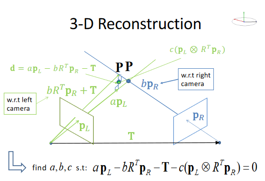
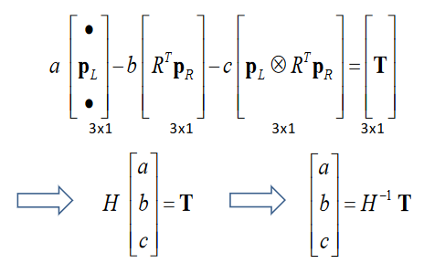

# 3D Reconstruction
**Epipolar Lines**

$$ p_R^TEp_L=0 \qquad u_L=Ep_L \\ p^T_Ru_L=x_Ru_{L1}+y_Ru_{L2}+fu_{L3}=0 \qquad =\text{Epipolar Line} $$

**Pixel Coordinates**

$$ S_x,S_y=\text{Width and height of each pixel}\\ (\hat x, \hat y)= \text{Pixel Coordinate} \\ (\hat o_x,\hat o_y)=\text{Principal Point (Where the principal axis cuts the image plane)} \\ \text{Image Coordinates: } \\ x = S_x(\hat x -\hat o_x) \\ y = S_y(\hat y -\hat o_y) $$

**Fundamental Matrix:**

$$ p_L=\begin{bmatrix} x_L \\ y_L \\ f  \end{bmatrix} =M_L\begin{bmatrix} \hat x_L \\ \hat y_L \\ f  \end{bmatrix}=M_L\hat p_L $$

$$ p^T_REp_L=0\implies \hat p_R^TM^T_REM_L\hat P_L=0 \implies \hat p^T_RF \hat p_L \\ F=M^T_REM_L =\text{The fundamental matrix} $$

In order to find the actual point P in the scene we can find the intersection of the epipolar lines, however they will usually never intersect so we can pick the closest point on each line and take the average of those points:

 

$$ ap_L=\text{Closest point to right epipolar line on left line} \\ bp_R=\text{vice versa} \\ bR^Tp_R+T \text{ is }bp_R \text{ wrt left camera} \\ c(p_L \times R_Tp_R) = \text{Perpendicular Vector} \\ ap_L-bR^Tp_R-T-c(p_L\times R^Tp_R)=0 \\ \text{Where a b and c are unknown} $$

Given corresponding points, we know: $ p_L, p_R $ 

Given calibrated views, we know: $ R, T $

$$ \hat p=\frac{(ap_L+bR^Tp_R+T)}{2} \text{ = Point in the scene at the average of the closest points} $$

 

