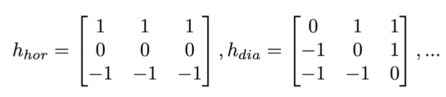
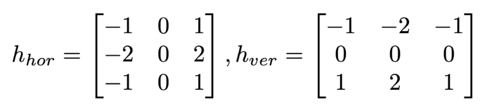
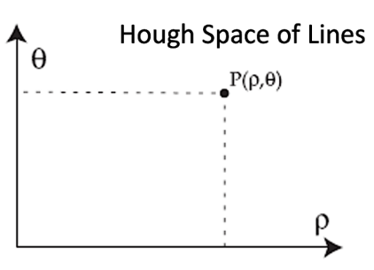

# Edge Detection and Hough Transforms
Recognition Strategy: Determine a measure of change in the pixel's neighbourhood. The first derivative in 2D space is the image gradient. 

$$ \psi=\text{Direct of the maximum growth of a function} $$

$$ |\nabla f(x,y)|=\text{Magnitude of growth} $$

$$ \phi=\text{Perpendicular to edge detection} $$

$$ |\nabla f(x,y)|=\sqrt{(\frac{\delta f}{\delta x})^2+(\frac{\delta f}{\delta x})^2} $$

$$ \psi=\arctan{(\frac{\delta f/\delta x}{\delta f/\delta y})}\qquad \phi=\psi-\pi/2 $$

$$ h_x=\begin{bmatrix} -1 & 0 & 1 \\ -1 & 0 & 1 \\ -1 & 0 & 1\end{bmatrix} \qquad h_y=\begin{bmatrix} -1 & -1 & -1 \\ 0 & 0 & 0 \\ 1 & 1 & 1\end{bmatrix} $$

If the image is very noisy we can use a larger neighborhood in our kernels. These masks are very sensitive to noise so instead we could use the Prewitt operator or the Sobel operator.

Prewitt:



Sobel (Gaussian):



**Hough Transform:**

The image space is transformed into a parameter space a voting procedure is carried out in the parameter space and object candidates are obtained as local maxima.

$$ \text{straight line: }f(x,y,\rho,\theta)=x\cos\theta+y\sin\theta-\rho=0  $$

$$ \rho=\text{Distance between origin and the line} $$



Each point in the Hough space is a line defined by its coordinates.

A point(x,y) in the image space is transformed into a sinusoidal curve in the parameter space. Each orientation of lines passing through p(x,y) represents a sinusoidal curve in the Hough transform.


```plain text
Make available an n=2 dimensional array H(a,b) for the parameter space
Find the gradient image G(x,y)=|G(x,y)|<G(x,y)
For any pixel satisfying |G(x,y)| > T increment all elements on the curve a = xcos(b)+ysin(b)
in the parameter space represented by the H array:

For all a | b=
```


