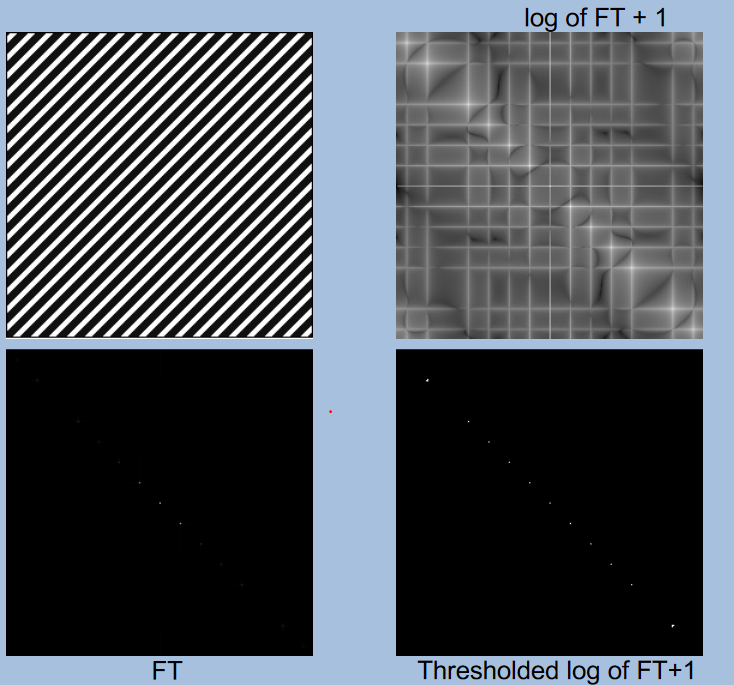

# Frequency Domain & Transformations
Lines in images will be perpendicular in the Fourier space.

Butterworth’s low pass filter:

$$ H(u,v)=\frac{1}{1+[r(u,v)/r_0]^{2n}} $$

Butterworth’s high pass filter:

$$ H(u,v)=\frac{1}{1+[r_0/r(u,v)]^{2n}} $$

Convolution in the spatial domain is equivalent to multiplication in the frequency domain (and vice versa):

$$ h=f*g\implies H=FG \qquad h=fg\implies H=F*G $$

 

