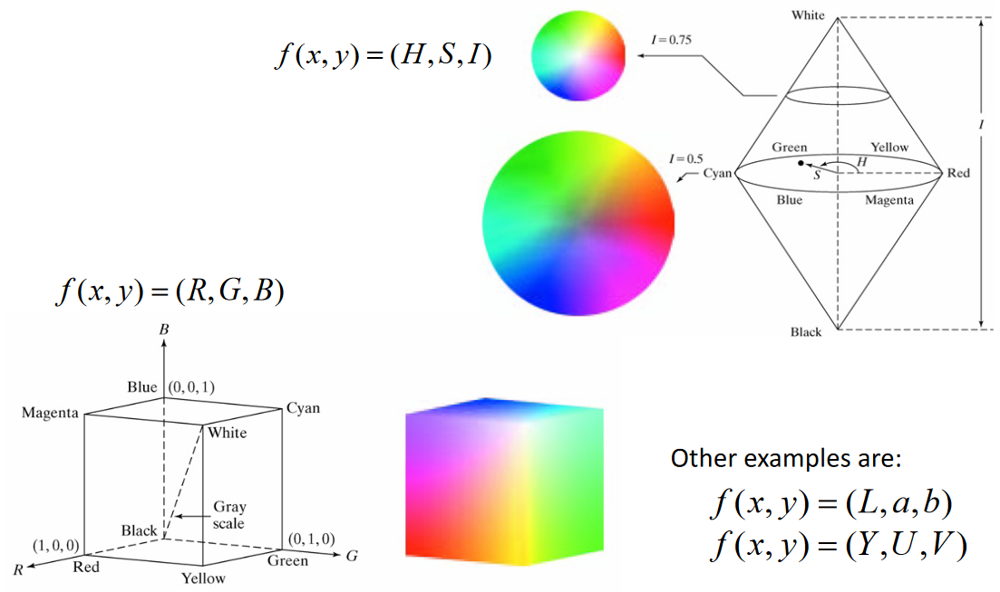

# Image Acquisition & Representation
Computer Vision Detection:

- Detection - “Are there x”

- Verification - “Is that y”

- Identification - “Is that a picture of x”

- Organisation

- Scene and context categorization

- 3D layout, depth ordering

Computer Vision Challenges:

- Orientation

- Illumination

- Occlusion

- Scale 

- Deformation

- Background clutter

- Object intra-class variation

- Local ambiguity

- The world behind the image

**Modelling a spatial brightness pulse:**

$$ \int_{-\infty}^{-\infty}\delta(t)dt=1 \qquad \delta(t)=\lim_{\epsilon \rightarrow0}[y_{\epsilon}(t)] $$

Sifting Property:

$$ \int_{-\infty}^{\infty}f(t)\delta(t)dt=f(0) \rightarrow \int_{-\infty}^{\infty}f(t)\delta(t-\alpha)dt=f(\alpha) $$

The sifting property can be used to express a 2D image function as a linear combination of 2D Dirac pulses located at points (a,b) that cover the whole image plane.

$$ \int_{-\infty}^{\infty}\int_{-\infty}^{\infty}f(a,b)\delta(a-x,b-y)dadb=f(x,y) $$

Ideally, the optical system should map point information to points. However optical systems are not ideal. Each point will have some spread which will be represented by a point spread function. An image is the sum of the PSF of all its points. The Point spread function can be modelled by the Dirac Impulse function.

**Point spread function:**

$$ g(x,y)=f(x,y)*(h,x) \qquad h(x,y)=PSF $$

**Colour Spaces:**

 

The effect of spare sampling is aliasing, anti-aliasing can be achieved by removing all spatial frequencies above a critical limit. Removing sharp edges.

