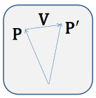
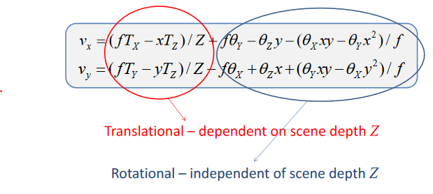

# Modelling and Optical Flow
Incremental 2-D motion fields represent the 3D translation vector of a pixel projected onto the 2D image plane. 

**Rigid Motion:**

$$ P'=RP+T $$

**Rotation Matricies Approximations:**

$$ R=R_XR_YR_Z \\ \text{For small } \theta: \\ \sin(\theta)\approx\theta \\ \cos(\theta)\approx1 \\ \text{Therefore for small }\theta_X,\theta_Y,\theta_Z: \\ R\approx \begin{bmatrix} 1 & -\theta_Z & \theta_Y \\ \theta_Z & 1 & -\theta_X \\ -\theta_Y & \theta_X & 1 \end{bmatrix} $$

**3-D Motion Field:**

$$ V=\lim_{\Delta t \rightarrow0}\left \{ P'-P=(R-I)P+T \right \}  $$

$$ \text{Hence for small angles: } \\ V_X=\theta_YZ-\theta V_X + T_X \\ V_Y=\theta_ZX-\theta_XZ+T_Y \\ V_Z =\theta_XY-\theta_YX+T_Z \\ {} \\ (\theta_X, \theta_Y, \theta_Z) = \text{ Angular Velociy} \\ (T_X, T_Y, T_Z) = \text{ Rectilinear Velocity} $$

**2-D Motion Field Equations:**

$$ \text{For image point p } = (x, y, f) \qquad \text{Motion field v}=(v_x, v_y) \\ v_x=\frac{dx}{dt}=\frac{d}{dt}\frac{fX}{Z}=f\frac{V_XZ-XV_Z}{Z^2} \qquad x=\frac{fX}{Z} \qquad V_X=\frac{dX}{dt} \\ {} \\v_x =\text{ Motion in the image plane in the x-direction} \\ \text{Substitute for} V_Z \text{ and } V_X: $$

A rotation without translation is independent of the depth

