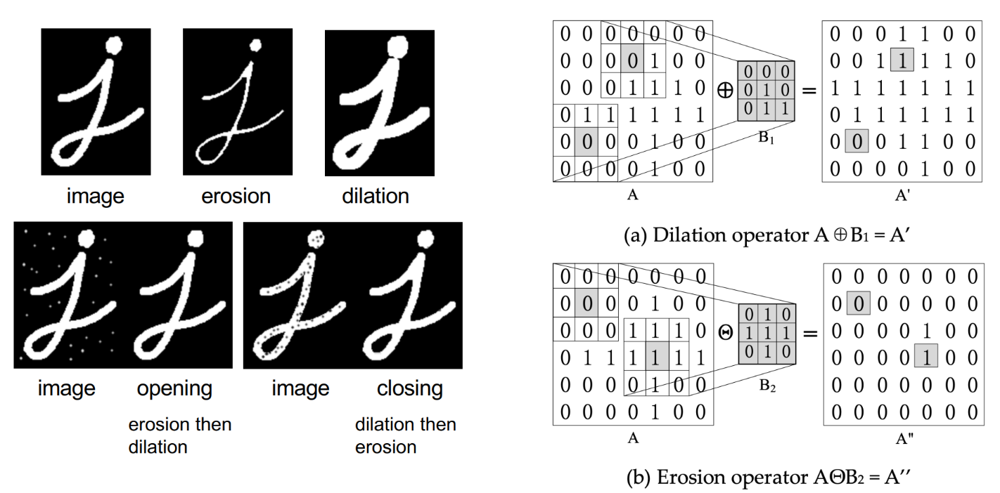
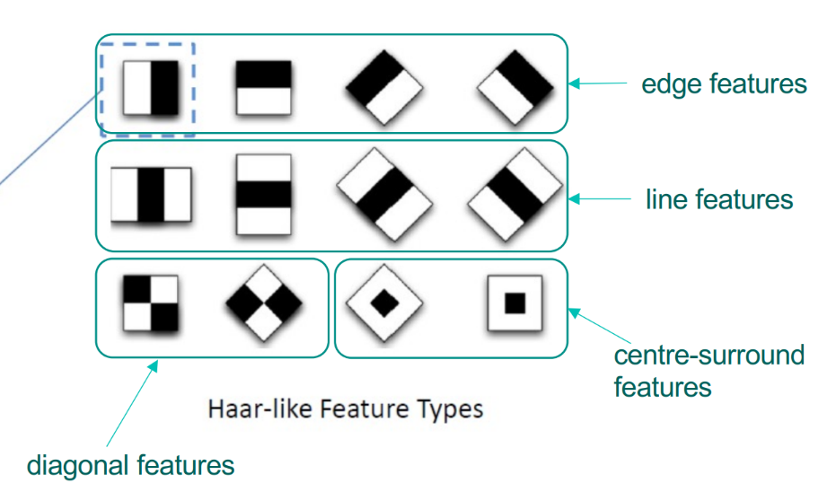
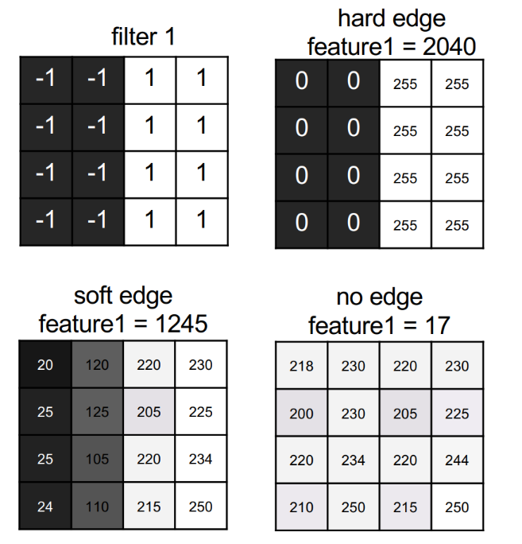
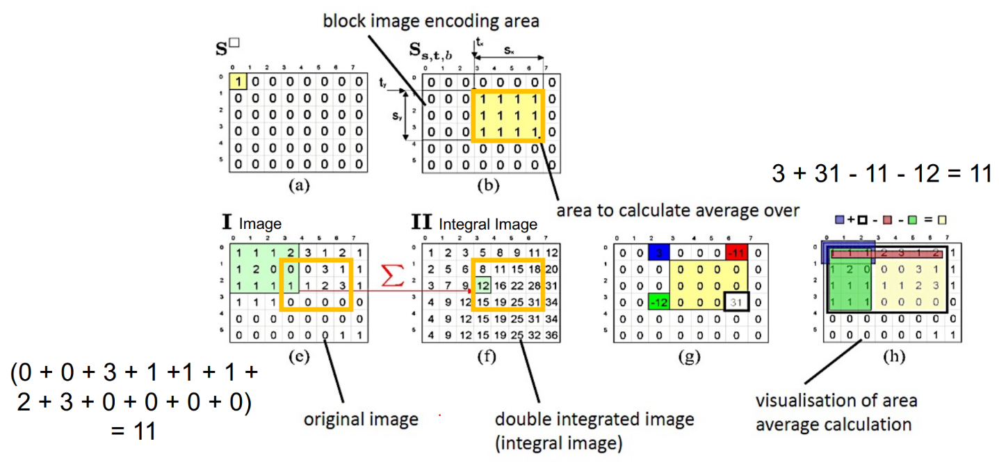
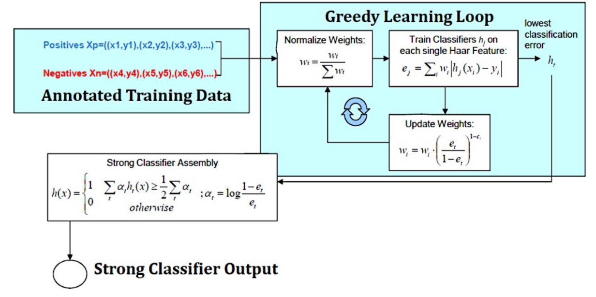

# Object Detection
Image regions need to be found and assigned with semantic labels from a space of object classes.

Shape detection and segmentation of their own rarely work for real-world object detection because of the following:

- High intra-class variance

- Low inter-class variance

- Classes are rarely well-defined

- Changes in illumination, scale, pose, deformation, occlusion

 

Terms:

Classification - Program tells you what is in the image

Localisation - Program tells you where the object is

Object Detection = Classification + Localisation 

**Colour Based Detection:**

Map 3D spacec to RGB space and cluster. Map this clustering back to image space.

**Morphological Operations:**

Erosion:

$$ A\Theta B=\{z|B_z\subseteq A\} =\text{Set of pixel locations z that overlap with foreground pixels in A} $$

Dilation:

$$ A\oplus B=\{z|\hat{B}_z\cap A \neq \phi\} $$

**Template Matching:**

A window is scaled and slided through an image, each resulting window is judged w.r.t. an object model giving a response indicating object prescence or abscence.

Find the maximum similarity or the minimum difference within the defined threshold. 

- Maximum:

 

$$ \text{corrolation =}\frac{1}{N}\sum_{i=1}^N(\frac{y_i-\mu_y}{\sigma_y})(\frac{\hat{y}_i-\mu_{\hat{y}}}{\sigma_{\hat{y}}})\\ \text{Pixel i in box y in the image, y is the same size as y, multplied by pixel y hat}\\\text{in the template} $$

- Minimum:

	- Mean Absolute Error

	- Mean Squared Error

Disadvantages:

- Doesnt work in other orientations

- Not very performant

- The objects in the image must be pixel by pixel similiar

**Optical Character Recognition:**

- First use Adaptive Gaussian Thresholding

$$ dst(x,y)=\begin{cases}maxValue\qquad \text{if src(x,y)>T(x,y)} \\ 0 \qquad \qquad \qquad \text{otherwise}\end{cases} $$

$$ T(x,y)=\text{Mean of neiborhood the area + a constant} $$

- Then deskew the image, detect straight lines and straighten

- Then segmentation to seperate characters + Erosion and Dilation

- Finally we can use feature mapping (Polygonal Approximation) to detect letters.

**Sliding Window Detectors:**

Haar Like Features:

[//]: # (column_list is not supported)

	[//]: # (column is not supported)

		

	[//]: # (column is not supported)

		

Integral Images:

In order to make the filtering faster we can first produce an integral image. The integral of an image is the sumation of all the pixels to the top left ofthe current pixel. We can compute this for specific areas in the image by computing the corners of the area and subtracting the bottom left and the top right.

AdaBoost Classifier:

Where:

$$ h_j(x)=\begin{cases}1 \text{ if }p_if_j(x) <p_j\theta_j \\0 \text{ otherwise}\end{cases} \\ \text{p = + or}-, \qquad \theta=\text{threshold} $$

 

