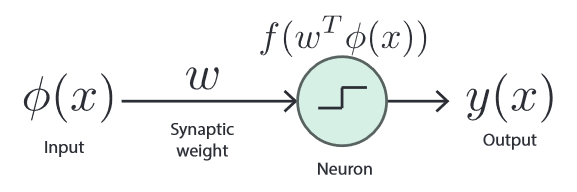

# Classification and Neural Networks
**Classification:**

Model - A discriminant function is a function that takes an input vector x and assigns it to a class Ck.

Linear Discriminant Function:

$$ y(x)=w_0+w^Tx \qquad w_0=\text{bias} \qquad x=\text{input vector}\qquad w=\text{weights} $$

For K = 2 if y(x) ≥ 0 add to class C1 else add to class C2

We can minimise the least squares (error function) to compute the optimal parameters.

This model only works for data that is linearly separable

 

**Logistic Functions:**

A logistic function can be used to obtain a probability of being in class Ck. For example:

	 

	$$ y(x)=\sigma(w^Tx)\qquad p(C_1|x)=y(x) \qquad p(C_2|x)=1-p(C_1|x) $$

When y→0 choose class 2 and when y→1 choose class 1.

**Logistic Regression - Maximum Likelihood Estimation:**

$$ p(t|x,w)=\prod_{n=1}^Ny_n^{t_n}(1-y_n)^{1-t_n}\qquad y_n=p(C_1|x_n)\qquad t_n \in\{0,1 \} \qquad \text{dataset} = \{n_n, t_n \} $$

In order to find the derivative of the negative log of this model we have to use an iterative technique to find a local minimum. We start with random weights and perform gradient descent.

$$ \frac{\delta \ln p(t|x,w)}{\delta w}\sum_{n=1}^N(y_n-t_n)x_n =\text{slope} $$

**Neural Networks:**

**Perceptron: **

$$ f(a)=\begin{cases}+1,a\ge0\\-1,a<0\end{cases}\qquad \text{target: }t=\{+1, -1\}\qquad \text{minimise: }-\sum_{n=1}^Nw^T\phi_nt_n $$

**Forward Pass:**

Compute Activations on hidden layer h:

$$ a_j=\sum_{i=1}^Dw^{(h)}_{ji}x_i+w^{(h)}_{j0} $$

Pass through a nonlinear function, typically sigmoid:

$$ Z_i=\sigma(a_j) $$

Calculate activations on the output layer:

$$ a_k=\sum_{i=1}^Dw^{(h)}_{ki}Z_i+w^{(h)}_{k0} $$

Then compute predications using the sigmoid function.

**Backward pass**

Compute the error (cost) function

$$ E=\frac{1}{2}\sum_{n=1}^N(y(x_n,w)-t_n)^2 $$

Compute the gradients wrt. weights:

$$ \text{Output Weights: }\frac{\delta E}{\delta w_{kj}}=\sigma'(y_n-t_n)Z_j $$

$$ \text{Input Weights: }\frac{\delta E}{\delta w_{kj}}=\sigma'(y_n-t_n)w_{kj}^T\sigma 'x_i $$

We can use these values to update the weights in our neural network:

	 

	$$ w_{ji}=w_{ji}-\sigma'(y_n-t_n)w_{kj}^T\sigma 'x_i \qquad w_{kj}=w_{kj}-\sigma'(y_n-t_n)Z_j $$

	 

