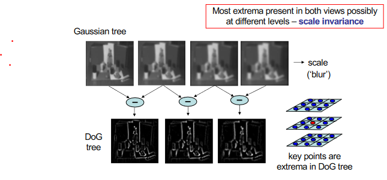
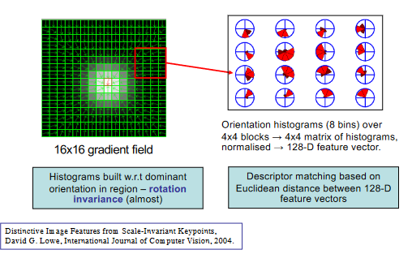

# Correspondence Matching
**Region Based Methods:**

Compare pixels values within regions in two views, for each region in the left image, compute similarity with regions of the same size in the right image. A corresponding point is the centre of the most similar region. Having large regions give more information for each pixel however there is an increased chance of a difference in depth (discontinuity). The problem with this method is that it can’t identify correspondences in areas with constant colours.

$$ \text{Stereo Image Pair: }I_L(x,y) \text{ and }I_R(x,y) \\ \forall I_L \in \text{ Left Image, find disparity } d=(d_x,d_y) \text{ which minimises (or maximises) the cost function} \\ {} \\ c(d)=\sum_{(i,j) \in W(x,y)}s[I_L(i,j), I_R(i+d_x, j+d_y)] \\ {} \\ W(x,y)=\text{Window of pixels around x and y} \\ s=\text{Similarity Measure} $$

$$ \text{Similarity Methods:} \\ \text{Sum of squared differences: }s(u,v)=(u-v)^2 \\ \text{Similar Pixel Count: }s(u,v)=\begin{cases} 1 && \text{if }|u-v|<T \\ 0 && \text{else}\end{cases} \\ \text{Normalised Cross Correlation: }\\ s(u,v)=\frac{(u-\bar u)(v-\bar v)}{N_uN_v} \\ N_u,N_v=\text{Std Deviation} \\ \bar u, \bar v= \text{Mean}  $$

**Feature Based Methods:**

Restrict search to a sparse set of features

- Reduces mis-matches caused by texture-less regions

- Find salient points in each view and match points by comparing pixels or image descriptors in local regions at each point.

**Harris Corner Detector:**

- Detects salient image points

- Covariance of spatial gradient vectors within region W

$$ A=\sum_{x,y\in W}\begin{bmatrix} I^2_x & I_xI_y \\ I_xI_y & I^2_y \end{bmatrix} \qquad I_x=I_x(x,y)=\text{Spatial gradient in x} \\ {} \\\text{Eigenvalues }\lambda_1, \lambda_2 \text{ of A indicate spread of gradients in region} \\ \text{Two high values indicate a busy region} \\ {} \\ \text{Saliency Metric }=\frac{\lambda_1\lambda_2}{(\lambda_1 + \lambda_2)} $$

**SIFT Matching:**

- Scale Invariant detection of salient points

- Matching by highly distinct local descriptors

Key Point Detection:

- Extrema in difference of Gaussian blurred images (Difference of Gaussian trees)

- Points imaged at different resolutions appear different levels of the DoG tree. This achieves scale invariance.

We can use a spatial gradient descriptor in order to compare key points. At key point we build a spatial gradient field. We can then build a histogram of regions inside the spatial gradient grid. The histograms document the direction vectors at each point in the grid. 

**Calibrated Cameras:**

For a calibrated stereo setup corresponding points lie on epipolar lines, hence given a point in the left image we are constrained to looking along the epipolar line in the right image.

- This increases speed as the search space is reduced and reduces mismatches

**Uncalibrated:**

When geometry is unknown we can only match pixel values - region or feature based approach

This often leads to mismatches amongst true matches known as outliers or inliers.

We know that inliers will be related by epipolar constraint equation $ \hat p^T_RF\hat p_L=0 $

We can use RANdom SAmple Consensus (RANSAC) to sort out:

- Select subset of matches at random

- Compute fundamental matrix F from subset

- Assess support for F amongst other correspondences

- repeat until best F is found

 

**Correspondence Matching:**

Harris Corner Detector/SIFT Matching (Identify Key Points and their correspondences) → RANSAC to remove outliers. 

 

