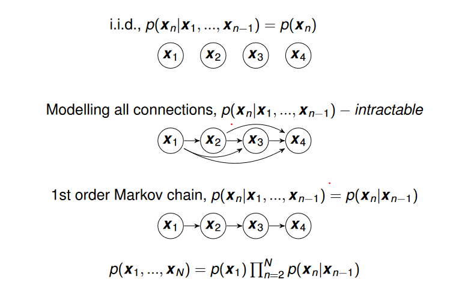
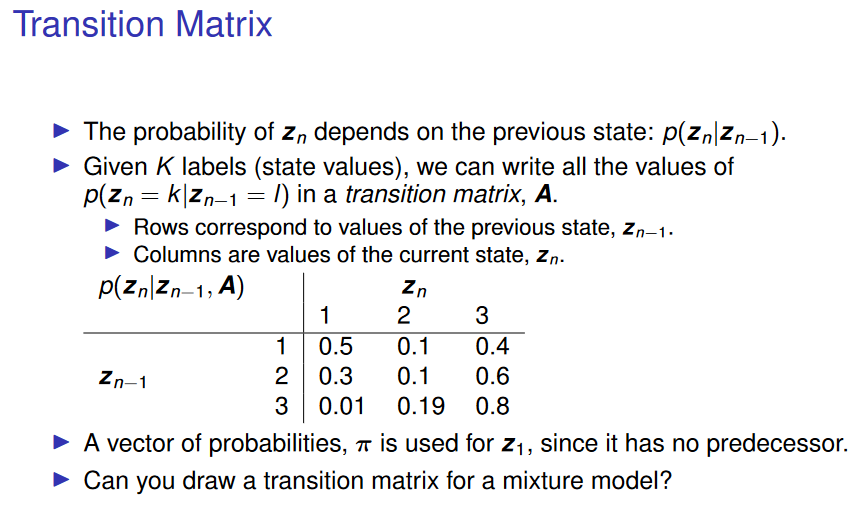

# Markov Models
## Sequential Data:

- The i.i.d. assumption ignores any ordering of the data points

- Data points often occur in a sequence such as a sequence of words in sentence, frames in a video or sensor observations over time

- This can be generalised to more than one dimension.

- Treating the timestamp is not generally an informative feature but the neighbouring data can be useful

We can model these neighbourhood dependencies:

 

- Stationary Distribution: Probability distribution remains the same over time ⇒ Homogeneous Markov chain

- The number of parameters increases exponentially with the order of the Markov Chain. Meaning higher-order models are often impractical.

For each state we have:

- Transition Distribution - Modelling dependencies betweeen states $ p(z_n|z_{n-1}) $

- Emission Distribution - Models observations given a latent state $ p(x_n|z_n) $

 

Emission Distributions:

Real valued observations may use gaussian emissions, discrete observations may use a categorical distribution.

For each observation there are K values of $ p(x_n|z_n,\phi_n) $ one fore each possible value of unobserved z_n

 

The complete HMM can be defined by the joint distribution over observations and latent states:

$$ p(X,Z|A,\pi,\phi)=p(z_1,\pi)\prod_{n=2}^Np(z_n|z_{n-1},A)\prod_{n=1}^Np(x_n|z_n,\phi) \\ {} \\ A, \pi, \phi \text{ are parameters that must be learned} \\ A=\text{Transition Matrix}\\ \pi =\text{Initial State Probability} \\ \phi = \text{Parameters of the emission distributions} $$

$$ \ln p(X,Z|A,\pi,\phi)=\ln \sum_Z \left \{ p(z_1,\pi)\prod_{n=2}^Np(z_n|z_{n-1},A)\prod_{n=1}^Np(x_n|z_n,\phi) \right \} $$

As with GMMs there is no closed form solution to the MLE so we must use EM, unlike GMM the likelihood doesnt factorise over the data points. 

The distribution of each term depends on all the terms before it, therefore we cant just sum over the values of z_n independently for each data point.

Goal: Maximise Expected Log Likelihood

$$ Q(\theta|\theta^{old})=\sum_Zp(Z|X,\theta^{old})\ln p(X, Z |\theta) \\ \text{Intialise } \theta^{old}=\{A, \pi, \phi \} \\ \text{E-Step: use }\theta^{old} \text{to compute expectations over Z required to compute }Q(\theta|\theta^{old}) \\ \text{We need to compute expectations of the latent states and pairs of latent states} \\ \text{Responsibilites: }\gamma(z_{nk})=p(z_n=k|X,\theta^{(old)}) \\ \text{State pairs: }\xi(z_{n-1},j,z_{nk})=\sum $$

 

This algorithms takes the training from exponential complexity to linear time complexity given the length of the inputs.

 

However given our estimated model parameters how can we predict a sequence of hidden states. The most probable labels given by $ \gamma(z_{nk}) $ are not the same as the most probably sequence. In order to get the most probable sequence we can use the Viterbi Algorithm.

 

**Viterbi Algorithm.**

In the forward pass, for each each state we save the maximum probability of a state having a particular value and we save the value that this was. 

In the backward pass we compute the most likely final state and we hen compute the most likely states that lead up to this final state. There are multiple paths leading to each possible state at each step, we only keep the path with highest probability so we don’t have to compute the likelihood for every complete path. 

