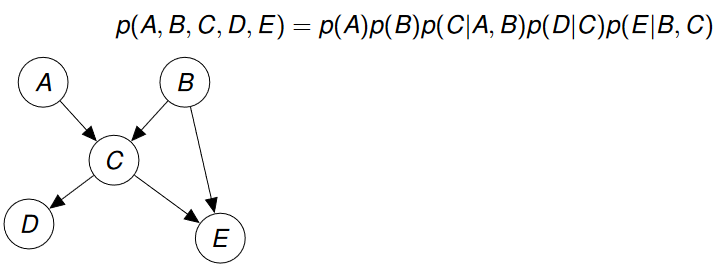
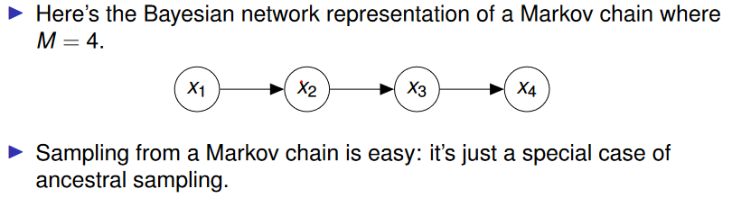

# PGMs for Bayesian Machine Learning
The goal of the Bayesian approach is to compute the posterior distribution:

$$ P(\theta|D=d) $$

Where theta is the parameter vector and d is the observed data. We must choose a prior distribution over theta

$$ \text{prior}=P(\theta)\qquad \text{likelihood}=P(D|\theta)\qquad \text{posterior = prior * likelihood} $$

$$ P(\theta|D=d)=P(\theta)P(D=d|\theta) $$

Usually computing the posterior is intractable, so we usually have to approximate it. We want to be able to construct a join distribution that best models the data-generating process.

We will assume that we have a method of sampling from any univariate distribution. (Distribution defined over a single variable). If a multivariate distribution is described by a Bayesian network then we can use ancestral sampling to sample a joint instantiation of the variables.

**Ancestral Sampling:**

Assume that these distributions are binary (they can only output 0  or 1). In order to sample P(A,B,C,D,E) we must first sample A and B, suppose A=0 and B=1, we can then sample a value for C from the conditional distribution P(C|A=0, B=1).

We can approximate any marginal distribution P(B,E) by sampling full joint instantiations (ancestral sampling) and we only keep the values of the variables in the marginal.

**Conditional Distributions:**

Use rejecting sampling to remove values that don’t meet the conditional for example to sample from P(B, D | E = 1) we sample from P(B, D, E) and discard samples where E ≠ 1. However, rejection sampling can be very inefficient.

**Approximating Expectations:**

Often we want to compute expected values with respect to some posterior distribution:

$$ E[f]=\int f(z)p(z)dz \qquad \text{ p = distribution} $$

We can draw independent samples from p(z) and then approximate the integral above:

$$ \hat{f}=1/L\sum_{l=1}^Lf(z^l) $$

**Markov Chain Monte Carlo:**

If we can sample from a distribution then we have a simple way to compute approximate values. but sometimes we cannot do this.

If we can sample from a sequence of distributions which eventually reaches the desired distribution then we can adopt the following strategy:

- Draw a sample from each distribution in the sequence

- Only keep the samples once we get close enough to the desired distribution.

A Markov chain is a series of random variables. The mth variable in the chain represents the mth state of some dynamic system such that the following expression is a state transition probability.

$$ p(z^{m+1}|z^m) $$

A Markov chain defines a sequence of marginal distributions; for the BN above these are P(x1), P(x2), P(x3), P(x4). The goal of MCMC is to design a Markov chain so that this sequence of marginal distributions converges on the distribution that we want. We can then sample the Markov chain and only keep the sampled values of later random variables. 

We are given a target probability distribution p(z), construct a markov chain z^1,…,z^i such that the limit as i tends to infinity of p(z^i)=p(z)

We can achieve this using the Metropolis-Hastings algorithm.

**Metropolis-Hastings Algorithm:**

Let the current state be z^t. 

- Generate a value z* by sampling a proposal distribution q(z|z^t)

- We accept z* as the new state with a certain acceptance probability.

$$ A(z^*,z^\tau)=min(1,\frac{p(p(z^*)q(z^\tau|z^*)}{p(z^\tau)q(z^*|z^\tau)}) $$

if p(z*)≥p(z^t) then we accept and move to z*

