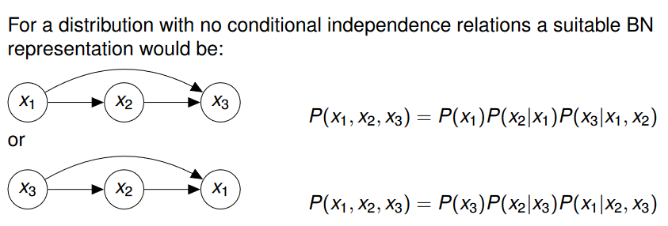
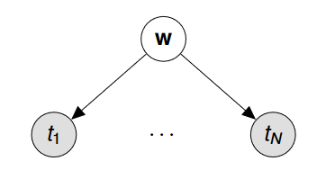
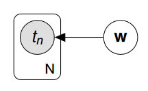
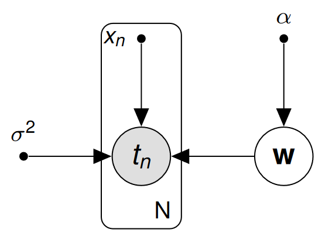
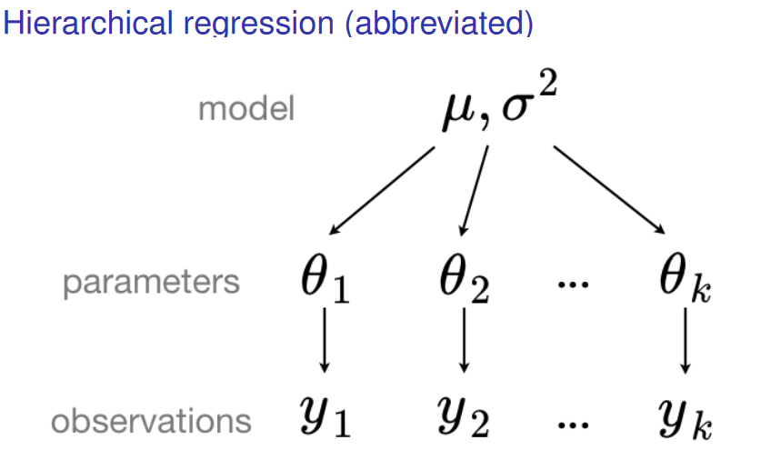

# Probabilistic Graphical Models
**Conditional Independence:**

$$ P(x_1,x_2,x_3)=P(x_1)P(x_2|x_1)P(x_3|x_1,x_2)\qquad P(x_3|x_1,x_2)=P(x_3|x_2) $$

Distribution P, x3 is independent of x1 conditional on x2.

This relationship can be shown with a directed acyclic graph.

 

An arrow from A to B means A is the parent of B. The set of parents of a node is pa_k.

$$ p(X)=\prod_{k=1}^Kp(x_k|pa_k)=\text{Joint Probability Distribution} $$

A given DAG represents a set of joint distributions, each distribution in the set corresponds to a choice of values for the conditional distributions. In a Bayesian approach, we have to define a prior probability distribution over parameters which represent our beliefs about their values prior to observing the data. 

**Polynomial Regression Model:**

$$ p(t,W)=p(W)\prod_{n=1}^Np(t_n|W)\qquad t=\text{data}\qquad W=\text{parameters} $$

This assumes that our data is independent and identically distributed (conditional on W). This can be represented by a bayesian network:

Dots here represent t_n that can’t fit in the space, instead of showing it like this we can use plate notation:

The full model contains:

$$ \text{data: }x=(x_1,...,x_N)^T \qquad \text{output: }t=(t_1,...,t_N)^T\qquad \text{parameter vector: }w $$

$$ \text{hyperparameter: }\alpha \qquad \text{noise variance: }\sigma^2 $$

Shaded circles can be observed, non-shaded circles cannot be observed.

 

**Hierarchical Regression:**

$$ P(\theta,y,\mu,\sigma^2)=P(\mu,\sigma^2)\prod_{i=1}^kP(y_i|\theta_i)P(\theta_i|\mu,\sigma^2) $$

**Conditional Independence:**

$$ P(x,y|S)=P(x|S)P(y|S)\implies\text{x is conditionally independent of y} $$

$$ P(A,B|C)=\frac{P(A,B,C)}{P(C)}=\frac{P(A|C)P(B|C)P(C)}{P(C)}=P(A|C)P(B|C) $$

$$ A\bot B|C \qquad \text{A and B are independent given C} $$

A collider is a node on some path where both arrows point to the node and both arrows on the path.

